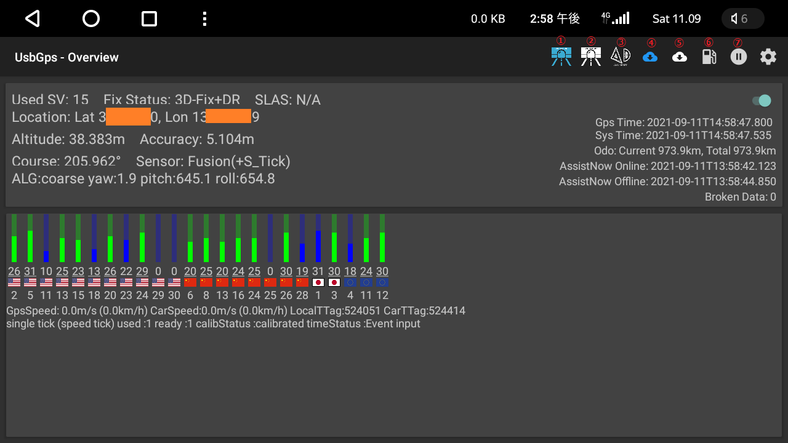

# UsbGps4Droid - For U-blox NEO-M8U

 freshollie氏のUsbGps4DroidをU-blox NEO-M8U向けに改造しました。  
 UBXバイナリを解析することで、NEO-M8U独自の高レートナビゲーションを疑似ロケーションに反映することができます。

[Download latest release](../../releases)

## スクリーンショット

## 変更点
* Android Head Unit(中華ナビ)向けの変更
  * MTCManagerによるKill対策
    * SLEEP開始時に特定のパッケージ名以外のアプリが自動起動不可となるため  
  アプリのパッケージをcom.microntek.\*に変更
  * SLEEP対応
    * SCREEN_ONのインテントを受信した場合にサービスを自動できるように変更
  * 自動起動高速化

* 全般
  * NMEAパーサーの廃止
  * UBXパーサーの追加
    * UBX-HNR-PVT
    * UBX-NAV-PVT
    * UBX-NAV-ODO
    * UBX-NAV-SVINFO
    * UBX-NAV-SLAS
    * UBX-ESF-ALG
    * UBX-ESF-STATUS
    * UBX-ESF-MEAS

* レイアウト
  * アクションバー上に以下を追加
    * ①自立航法のテストモード開始
    * ②自立航法のテストモード終了
    * ③センサー状態のリセット
    * ④AssistNowOnlineの取得
    * ⑤AssistNowOfflineの取得
    * ⑥ODOメータのリセット
    * ⑦ログの記録開始／停止
  * 上部レイアウトに以下の項目を追加
    * 測位状態  
    * 進行方位  
    * センサーの状態  
    * SLAS（サブメータ級測位）の状態  
    * ODOメータ
    * 破損データ件数の表示
  * 下部のレイアウトに各衛星の測位状態を表示  
    * 信号強度、衛星種類、衛星番号の順で表示しています。  
      ナビに使用している衛星はグラフが緑色になります。  
      エフェメリス取得が完了したものは信号強度にアンダーバーが表示されます。
    * 車速パルス関係の情報を表示

* ナビゲーション
  * 疑似ロケーションへの反映設定を追加
    * Use Ground Speed - 速度の反映有無
      * 一部のナビソフトはこの値を使用して位置情報を補完します。(Yahoo!カーナビ等)
        DRモジュールの場合は基本的にはオフを推奨
    * Use Accuracy - 精度の反映有無
      * 一部のナビソフトはこの値をしようして位置情報の使用可否を判定します。
        無効にした場合は水平方向の精度のみ1m固定になります。  
      (Yahoo!カーナビ、GoogleMaps等)
    * Use UBX-HNR-PVT - UBX-HNR-PVTの位置情報反映有無
      * 無効にした場合はUBX-HNR-PVTのバイナリを無視します。（レシーバ側の設定変更は行いません）
        負荷が高い場合はこの設定を無効にすることで改善する場合があります。

* UsbGPS側の設定変更
  * config UBX-CFG-HNR - 高ナビレートの変更
    * 0 ~ 30を指定した場合、通信開始時に設定変更コマンドをUSBに送信します。  
    -1を指定した場合は、コマンドは送信しません。
  * config UBX-NAV-RESETODO - ODOメータのリセット
    * 有効にした場合、通信開始時にODOメータのリセットコマンドをUSBに送信します。

* AssistNowOnline及びOfflineに対応
  * 起動時及びツールバーのボタン押下時にAssistNowの情報を取得することが可能です。
    (configにてAssistNowのTokenを設定が必要)

* センター状態のリセット機能
  * センサーのキャリブレーション状態をリセットします。
    未接続状態でモジュールの位置を動かした場合などは、リセットしたほうがいいです。

* 自立航法テスト機能
  * ツールバーのボタンにて疑似的に衛星情報を使わない状態にすることで、自立航法のテストが可能です。
    内部的にはUBX-CFG-NAVX5の設定を変更し、MinC/NOを50dbHzにしています。
    既存の設定値をPoolして必要な部分を書き換えるような実装ではなく、
    UBX-CFG-NAVX5の全体を書き換えるごり押し実装なので、一旦USBを抜いてもらえば完全に元の状態に戻せます。

* NEO-M8L向けの情報表示
  * 下部にUBX-ESF-MEASの情報を表示しています。

## 動作確認環境
* Android
  * Nexus7 2013(Android6.0)  
  * Dasaita Android Head Unit(Android8.0)  
  * Isudar Android Head Unit V72(Android10)

* USBGP
  * DROTEK Ublox NEO-M8U GPS + LIS3MDL compass (XL)  
  * NEO-M8L

## Q&A
* Q.最低限必要なモジュール側の設定は？
  * A.
    * UBX-CFG-GNSSで、BeidouかGlonassのいずれかを有効化
      QZSSのL1sとGalileoも有効化
    * UBX-CFG-MSGにて、UBX-NAV-PVT,UBX-NAV-SVINFOをUSB出力するように設定する。
      (UBX-HNR-*,UBX-ESF-*はお好み)
    * UBX-CFG-PRTの設定でUSBのProtocol outをUBXにする。
    * M8UやM8LはUBX-CFG-ESFALGでAutoも有効にすると良い。
    * 最後にUBX-CFG-CFGでFLASHへの書き込みは忘れずに。

* Q.Broken Dataのカウント数が増える。
  * A.たぶんNMEAが有効になっている。UBXのみにもかかわらず増える場合はモジュールの接続方法の問題の可能性が高い。

* Q.一度センサーがキャリブレーションしても、すぐに初期状態に戻ってしまう。
  * A.モジュール側のバックアップバッテリーが機能していない可能性が高い。
      現状で手に入るモジュールは、ほぼこの問題を抱えているため対策必要。

* Q.Android10でサービスの自動起動ができない。
  * A.Android10では、ユーザアプリのBOOT_COMPLETEインテントによる自動起動が不可に変更されていると思われます。
    システムアプリ化することで自動起動が行えるようになります。

## その他
* NEO-M8U側はUBXのみ出力するように変更することを推奨します。  
* UBX-NAV-ODOはデフォルトでは無効になっているのでODOメータの表示が必要な場合は有効化してください。  
* 高レートで使用する場合はボーレートを115200にすることを推奨します。
* NEO-M8U向けですが、U-bloxのM8シリーズなら使えるはずです。  
* Android8の場合、USBの権限確認ダイアログは以下を参考にすると回避可能  
https://stackoverflow.com/questions/13726583/bypass-android-usb-host-permission-confirmation-dialog/30563253#30563253  
なお、中華ナビのOreo機でSystemUI.apkを書き換える場合は、Malysk氏のカスタムロムを適用するとvdex、odexを気にしなくて良くなるので楽です。  
IsudarのV72等のUIS7862機は基本的にUSB権限確認ダイアログが表示されないので不要でした。
`GPL v3`
